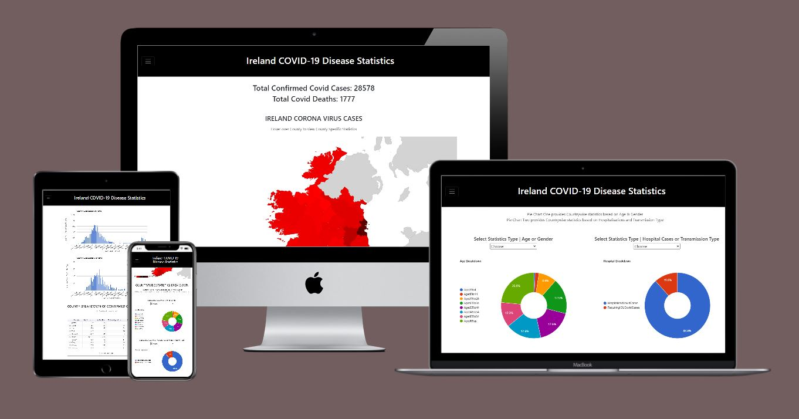

--------
<h1 align="center">Ken Cormican | Interactive Front End Development | Milestone Project Two </h1>

## Demo

[View the live project here.](https://kencormican.github.io/milestoneProjectTwo/)

--------

## Purpose

I've chosen to develop a Website that produces an Irish COVID 19 Statistics Dashboard, integrating functionality from the Google Maps & Charts APIs
with dynamic open source COVID statistics acquired through a geoHive API call.
My intent is to use the OpenSource Government Data Set to provide a hypothetical end user with accurate and localised COVID information.

--------

<h2 align="center"></h2> 

This is my Second Milestone Project for the Code Institute's Diploma in Full Stack Development.

--------

## The Project Brief
--------
The brief was to create an Interactive Web Front End that exposes the learnings from the HTML, CSS, JS, UXD & Interactive Front End Development Modules. 

1. Design, develop and implement a dynamic front-end web application using HTML, CSS and JavaScript
2. Implement front-end interactivity, using core JavaScript, JavaScript libraries and/or Application Programming Interfaces (APIs)
3. Test an interactive front-end web application through the development, implementation and deployment stages
4. Deploy an interactive front-end web application to a Cloud platform
5. Demonstrate and document the development process through a version control system such

--------

## User Experience (UX)

- ### Requirements

    Use the Google API too render a COVID 19 Heat Map of Ireland broken down by County Boundary.
    The Map should be responsive allowing end user to request more detailed statistics by selecting the county on the MAP.
    I addition to the heat map, A Government data set should be used to provide an accurate breakdown of infection and/or death rates :
        * per County
        * based on Gender
        * per Age category

    The End user should also be able to select a specific date range and the website should produce graphs or pie charts reflecing 
    Age, Gender, Number of Hospitalisations and Transmission Type statistics.

- ### User stories:

User    | Ask                                                                                                                   |
:--     | :---------------------------------------------------------------------------------------------------------------------|
1       | I would like to have localised figures showing the number of infected people and the number of deaths for each county.|
1       | I would like to see how the disease is affecting different age groups.                                                |     
2       | I want to know if children are vectors?                                                                               |
2       | What is the ratio of infected Men vs Women?                                                                           |
3       | What was the peak and when did it occur?                                                                              |
3       | How does that compare to now?                                                                                         |

- ### Design

    -   #### Colour Scheme
        -   I felt that a basic black and white webpage design was more aesthetically pleasing.
        -   Colour is to be introduce through the Geographic Heatmap, Bar, Table and Pie charts.
        -   Minor changes have been made to defaults introducing charcoal grey on hover for several toggle icon and footer anchor elements.
        -   Changes have been made to the bootstrap defaults of rthe table button slider to align with the Google Table Chart colour scheme.
    -   #### Typography
        -   The Roboto font is the Bootstrap default and with Sans Serif acting as the fallback font.
        -   A Font awesome icon has also been added to the footer anchor.
        -   The Page Title is altered from a single line to two lines using jQuery to render more clearly at small window sizes.
    -   #### Imagery
        -   The Heat Map provides a central Hero image, with Blue Bar charts, Table and Doughnut styled Pie Charts providing secondary points of focus.
    -   #### Responsive Design
        -   The Headline data will be rendered at all window sizes.
        -   The Heat Map and Headline data will be rendered at all window sizes but changes from a 12 unit column to 10 units at the medium breakpoint.
        -   The Gender, Age, Hospitalisation & Transmission Type Pie Chart render at all window sizes moving from stacked to side by side at the medium breakpoint.
        -   The bar charts  render to page beyond the medium breakpoint but change from a 12 unit column to a centered 10 unit column for large windows.
        -   The Table only renders to page beyond the large breakpoint.
        -   The Toggle Menu changes to reflect available elements across breakpoints.
        -   The Pie Chart image wrapper had to be altered at different breakpoints to interwork with the Google API & render cleanly at different window sized. 
    -   ##### Interactive Design
        -   The Google Geo, Charts & Table libraries provide an inbuilt interactivity features including responsive data on hover.
        -   In addition to the above an interactive table view slider and dropdown menues have also been added.
        -   The Table slider button allows the end user to expose partially hidden table data on click.
        -   The Select Dropdown menues allow the end user to select the type of information displayed by the Pie Charts.
        -   The default Navbar toggle behaviour has also been altered to collapse when a nav link item has been selected.

-  ### Wireframes

    -   Basic Wireframe Mockup Small, Medium & Large Window Sizes - [View](assets/wireFrames&Mockups/wireframes.jpg)

    -   Detailed Balsamiq Mockup Small, Medium & Large Window Sizes - [View](assets/wireFrames&Mockups/detailedBalsamiqMockup.jpg)

## Features

-   Responsive at small, medium and large device sizes

-   Interactive elements:
    All maps and charts rendered using the Google APi provide an inherent degree of interactivity
    Seperately the default behaviour of the Navbbar toggler, the Table and the Pie Charts has been altered to provise a more user friendly experience.

--------

## Technologies Used

### Languages Used

-   [HTML5](https://en.wikipedia.org/wiki/HTML5)
-   [CSS3](https://en.wikipedia.org/wiki/Cascading_Style_Sheets) 
-   [JAVACRIPT](https://en.wikipedia.org/wiki/JavaScript) 

### Frameworks, Libraries & Programs Used

1. [GeoHive API Catalogue:](https://opendata-geohive.hub.arcgis.com/search?q=covid)
    - The GeoHive API Catalogue was used to dynamically acquire up-to-date Open Source COVID-19 statistics for the whole of Ireland.
1. [Google Charts API:](https://developers.google.com/chart/interactive/docs)
    - The Google Charts API was used with the Geographic, Table, Bar & Pie Chart libraries to render the Countrywide data to the page.
1. [Bootstrap 4.5.2:](https://getbootstrap.com/docs/4.5/getting-started/introduction/)
    - Bootstrap was used to assist with the responsiveness and styling of the website.
1. [Font Awesome:](https://fontawesome.com/)
    - Font Awesome was used for the footer nav icon for aesthetic and UX purposes.
1. [jQuery 3.5.1:](https://jquery.com/)
    - jQuery was used to enhance the default Bootstrap navbar behaviour, to alter the tile at different breakpoints and to make the table & Pie Chart displays more interactive.
1. [jQuery.csv:](https://github.com/typeiii/jquery-csv)
    - jQuery.csv was used to process the CSV data into arrays before rendering the Heat Map and table to the web page.
1. [Git](https://git-scm.com/)
    - Git was used for version control by utilizing the Gitpod terminal to commit to Git and Push to GitHub.
1. [GitHub:](https://github.com/)
    - GitHub is used to store the projects code after being pushed from Git.
1. [Microsoft Excel:](https://en.wikipedia.org/wiki/Microsoft_Excel)
    - Microsoft Execl was used to alter the CSO County spreadsheet into a workable format.
1. [Microsoft Paint:](https://en.wikipedia.org/wiki/Microsoft_Paint)
    - Microsoft Paint was used to create the responsive image for the ReadMe.md and to capture the balsamiq & wireframe images in a generic format.
1. [Balsamiq:](https://balsamiq.com/)
    - Balsamiq was used to create the [wireframes](assets/wireFrames&Mockups/detailedBalsamiqMockup.jpg) during the design process.
1. [IntroJS](https://introjs.com/)
    - IntroJS was used to provide a toolTip type walkthrough of the webpage development process.

--------
## Development Process 

*   The Initial plan was to produce a (multidimensional) Ireland based COVID statistics web page. Following exploration of the user stories and similar International websites I landed on the 
    concept of producing an Irish heat map providing Covid statistics based on county boundary. I also noted that all websites currently providing Ireland statistics did not  provide death 
    rates on a county by county basis.The High level plan was to provide accompanying tabular, bar/line chart and pie chart data to support the statistics and to provide a further breakdown 
    of cases based on date, age and  gender.
*   Initially I was focused on using the Google Maps API to render the COVID data Set. For the COVID data Set I looked a multiple sources but ultimately settled on the geoHive API. It is an open 
    source API and provides a dynamic daily statistics for both Country and County.  Re the Google Maps API I looked at and tested multiple approaches to rendering the Data Set on a per county basis.  
    These included using XML based KML Layer data acquired from the GADM Utility and TopoJSON data to render the polygon county boundaries on the Google Map. Given the construction of the Google Maps 
    API call it also proved difficult to mask the API Key. Ultimately I settled on the Google Charts API.  It natively supported rendering of Geographic county boundaries and also provided libraries 
    for rendering heat maps, bar chart and pie chart data.
*   Having tested the geoCharts library with a static array of county data I went about testing the geoHive opensource API calls and data manipulation. The initial plan was to make two discrete API 
    calls to two separate Data Sets. The first would provide the country wide base data set and the second would provide the county specific breakdown. Initially I used an XHR request per the "Consuming 
    APIs Using JavaScript" tutorial and went about converting the nested JSON objects to a 2D Array using the approach described within the Tabular Data Modules. The approach worked well, and I was able 
    to use console.logs() at various points within the parsing process to determine I had produced a viable 2D array. I also completed the parse Headline data function which captured the most recent 
    iteration of the Total Confirmed Cases and Total Confirmed Deaths from the Countrywide Array.At this point in time I moved from the XHR fetch process to a jQuery.Get via a $.when/.then promises, as 
    described in the GitHub API module.  I felt it was cleaner and better suited to working with multiple responses from simultaneous API calls for the Countrywide and county specific datasets. 
*   Unfortunately, having successfully made calls to both datasets and passed the resultant responses into their own respective arrays I noted that the county death statistics contained null values for 
    each cell.  I believe this is why the majority of the other Ireland COVID trackers omit this information.I then set about looking for another source with a comparable dataset that provided the necessary 
    statistics.  While there were no publicly available API sources I was able to find a spreadsheet hosted by the Central Statistics authority that provided the necessary breakdown of deaths by county.
    I felt that while this data would be static it provided the necessary proof of concept to proceed. I began by converting the Spreadsheet to the appropriate CSV format.  I then used an Ajax() requested 
    to fetch the CSV data and nested for loop to iterate through the rows and columns and produce the necessary 2D array output.  
*   However, I encountered problems with both functional scope and type constraints errors when passing the array data to the Google API function. I also noted through use of console.log that the render 
    function was iterating twice.To verify the array type was a standard array as opposed to JSON array I used the jQuery $.isArray & $.makeArray methods at the point they were received into google function.
    Having confirmed they were good I then created a static array inside the package loader but outside the map render function. I then used the arrayToDataTable() method and successfully passed that into the 
    render function as an argument. Having confirmed the arrayToDataTable() method worked as anticipated I attempted to introduce a Jasmine based approach to testing.  I thought it might aid in identifying 
    the root cause of the problem. Unfortunately I encountered difficulty dealing with the testing of outputs from nested functions. I spoke at length with the Tutor team , re resolving the issues, and the 
    recommendation was to drop the jasmine testing (as testing of nested functions was outside the scope of the course) and focus on resolving my other issue (Functional vs Global scope and passing array data 
    to the Google API Call). Ultimately, the problem turned out to be unrelated to type. The root cause was solely specific to scope. I resolved the problem with scope and type by encapsulating the google 
    Render process in its entirety with a separate function that I used to pass in the array arguments.  The problem with type was perceived only and a direct result of the double iteration of the render 
    function by calling it a 2nd time from outside the package loader.
*   While I successfully passed the data to Google function I noted the time it took to iterate through the country data resulted in a circa 5 second delay to rendering the Map.  This was as a result of the 
    circa 30K iterations required to parse the countrywide JSON object data to a 2D array. I felt this would produce a negative user response so set about providing a cleaner more timely process. So for the 
    Bar Chart timeline I moved away from the nested Object.entry(), forEach(), dataRow.push(), tableRows,push()  methods to a map() object filter followed by a forEach() .push([]) operation to produce the 2D 
    Array. This improved parsing times significantly.I also moved from the Ajax request to a jQuery.Get() via $.when()/.then promise for the CSV fetch and added the jQuery.csv library to parse the response.  
    I felt it was a more concise approach to parsing the CSV data.
*   Following that I tested the Google Charts function with static data to simultaneously render the heatMap with, Bar charts and Pie Charts. I then went about parsing the bar chart deserialising the mapping 
    of the Unix timestamp to local date function. I noted the bar chart rendering operation was constrained in terms of x-axis functionality but produced two clean graphs, mapping dynamically acquired Confirmed 
    Daily Cases and Confirmed Daily deaths over the lifetime of the disease. I also removed the legend and updated the chart height, titles and axis descriptions to make the rendered graph more aesthetically 
    pleasing. Having rendered the dynamic Bar Charts with the heat Map I moved onto parsing the pie chart data. Unfortunately, the data set available countrywide was not duplicated for each county. The Pie Chart 
    Data also requires the columns to be transposed to the rows and vice versa.

## Credits

The loader gifs used for this educational project are licensed for non-commercial use.
The links to the licenses and descriptions are attached below for reference:

[File:Android style loader.gif](https://commons.wikimedia.org/wiki/File:Android_style_loader.gif)
[File:Loadingsome.gif:](https://commons.wikimedia.org/wiki/File:Loadingsome.gif)
[File:InternetSlowdown Day.gif:](https://en.wikipedia.org/wiki/File:InternetSlowdown_Day.gif)

Elements of the Responsive Typography were provided by Christian Oliff.
[View](https://christianoliff.com/blog/bootstrap-with-rfs)
This is a Quickfix to facilitate responsive typography in the absence of RFS via CDN for bootstrap 4 
   

